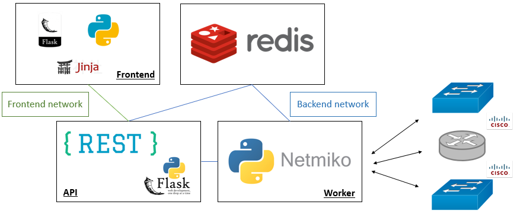
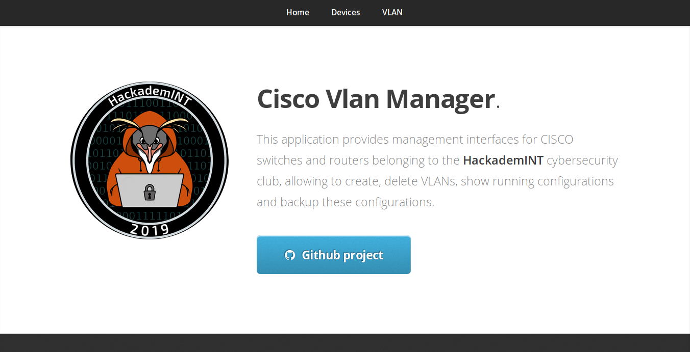
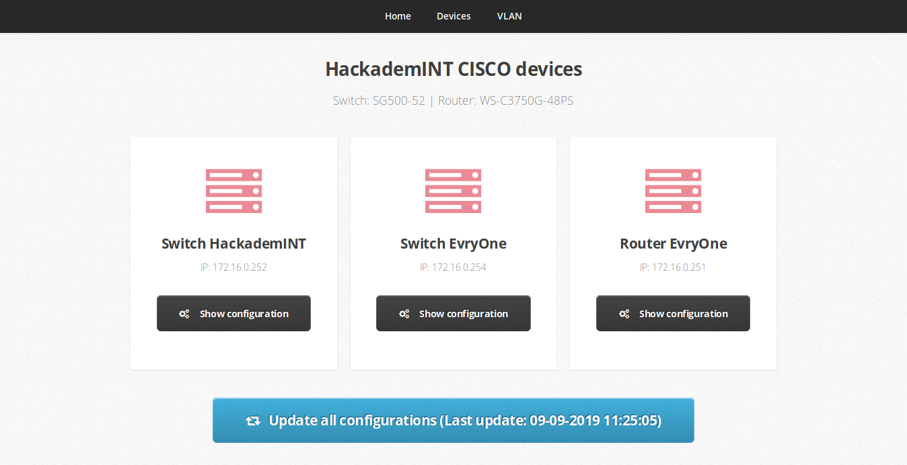
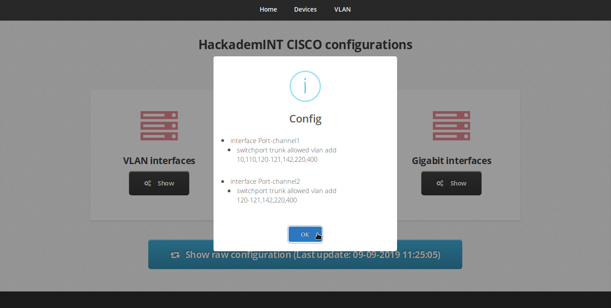
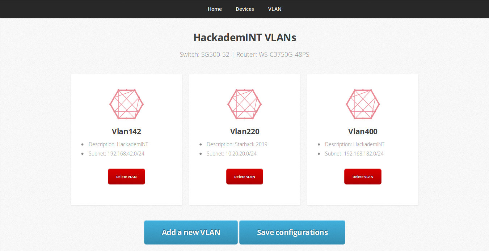

# cisco-vlan-manager

## Schema



## Configuration

```bash
cd worker
mv config{.example,}.py
```

Replace the default configuration with your devices credentials (secret fiels is for Cisco enable password)

## Install

```
docker-compose up
```

If you need to rebuild docker images you can:
```bash
docker-compose rm
docker-compose --build --force-recreate
```


## API endpoints

### [GET]

- `/update`: Read from `'update'` redis stream, It contains messages about worker events.
```python
redis_app.xread(streams={'update': 0}, count=1)
```

- `/config`:  Fetch running configurations stored in the redis key `'cisco_config'`
```python
redis_app.get('config_cisco')
```

### [POST]

`/action`: Store tasks for worker in the redis stream `'todo'`

- `{'type': 'add'}`: Add a new VLAN on cisco devices

- `{'type': 'remove'}`: Remove an existing VLAN on cisco devices

- `{'type': 'update'}`: Update running configurations in the redis key `'config_cisco'`

- `{'type': 'save'}`: Save current configurations on devices (`write memory`)

```python
redis_app.xadd('todo', {'json': content})
```

## Frontend result










## Manual deployment

Example for adding a new VLAN:
- `VLAN ID = 333`
- `subnet = '10.88.77.0/24'`


```bash
git clone https://github.com/zteeed/cisco-vlan-manager.git
cd cisco-vlan-manager/worker
python3 -m virtualenv venv
source venv/bin/activate
pip install -r requirements.txt
mv config{.example,}.py
vim config.py  # update credentials with real ones
python
```

```python3
from src.devices_functions import get_devices, disconnect_devices
from src.redis_job import make
devices = get_devices()
action = dict(type='add', vlan_num=333, subnet='10.88.77.0/24')
make(devices, action, '999')
disconnect_devices(devices)
```
